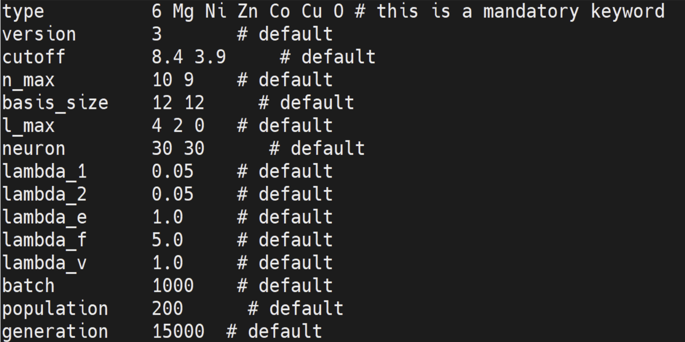
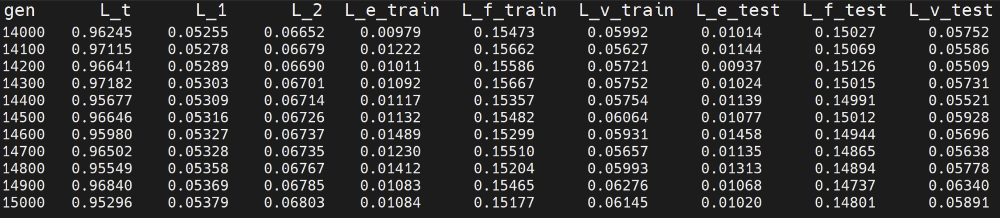
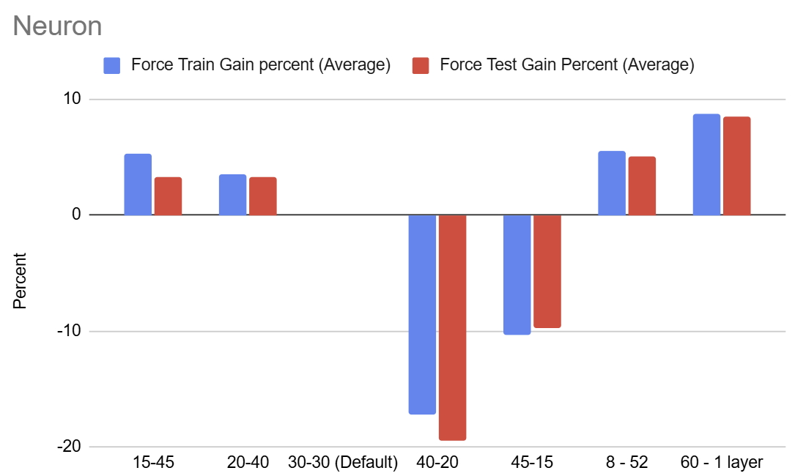
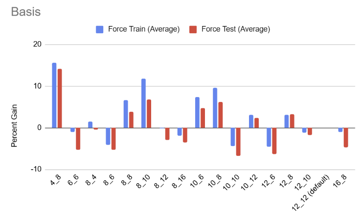
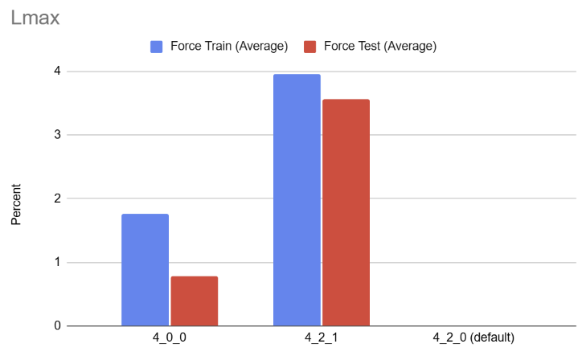
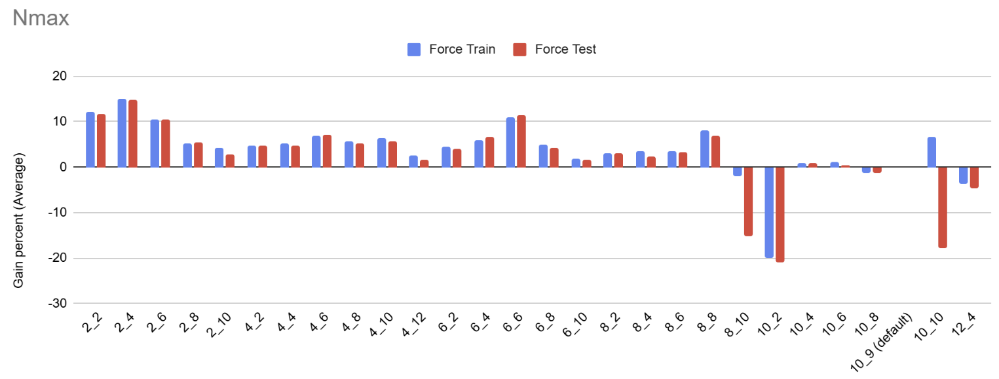
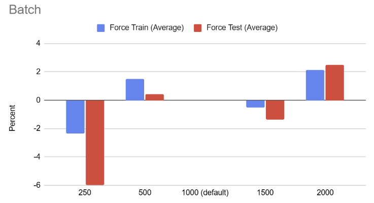
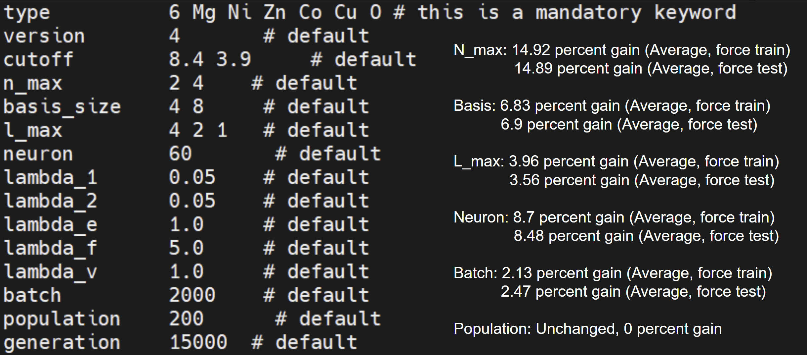
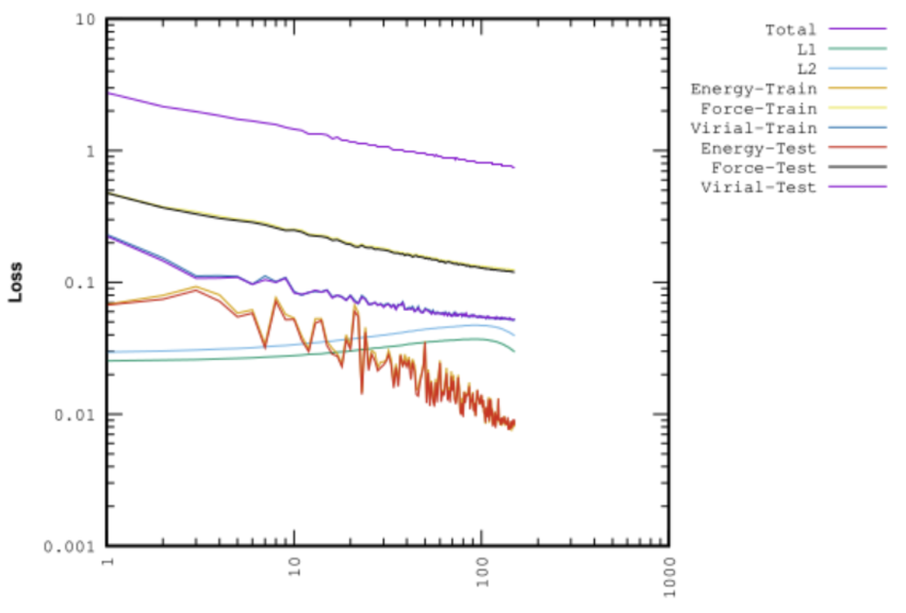
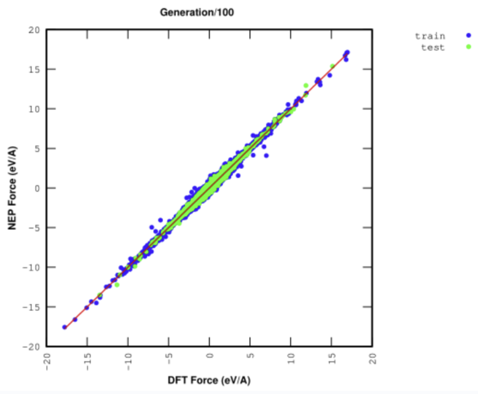

# Training and Results for J14 Potential

## Table of Contents

1. [Introduction](#introduction)
2. [Default Parameters and Initial Loss](#default-parameters-and-initial-loss)  
   - [Default Setup](#default-setup)  
   - [Default Loss](#default-loss)  
3. [Phase 1: Minimizing the Loss for Individual Parameters](#phase-1-minimizing-the-loss-for-individual-parameters)  
   - [Approach to Minimizing Loss](#approach-to-minimizing-loss)  
   - [Optimized Parameter Configurations and Results](#optimized-parameter-configurations-and-results)  
     - [Optimized Neurons Setup](#1-optimized-neurons-setup)  
     - [Optimized Basis Setup](#2-optimized-basis-setup)  
     - [Optimized Angular Expansion (`l_max`) Setup](#3-optimized-angular-expansion-l_max-setup)  
     - [Optimized Radial Expansion (`n_max`) Setup](#4-optimized-radial-expansion-n_max-setup)  
     - [Optimized Batch Size Setup](#5-optimized-batch-size-setup)  
4. [Phase 2: Combining Optimized Parameters](#phase-2-combining-optimized-parameters)  
5. [Loss Graphs and Analysis](#loss-graphs-and-analysis)  
   - [Force Loss Graph](#force-loss-graph)  
   - [Force Comparison Graph](#force-comparison-graph)  
   - [Weight Analysis from `nep.txt`](#weight-analysis-from-neptxt)  
6. [Conclusion and Future Work](#conclusion-and-future-work-for-phase-1-and-phase-2)

## Introduction

This section presents the training process and results using the **J14 Potential** dataset. The goal is to minimize the **force loss** through training with **NEP4 (Neuroevolution Potential)** to improve the accuracy and efficiency of molecular dynamics (MD) simulations, particularly for predicting thermal conductivity and material behavior.

For detailed input parameter descriptions, refer [here](https://gpumd.org/nep/input_files/nep_in.html#index-0).

---

## Default Parameters and Initial Loss

We begin the training process by setting up the **default parameters** for the NEP model, which establish a baseline for the force loss. These initial parameters are critical as they set the starting point from which we’ll measure the effectiveness of any optimizations. By configuring default values, we create a benchmark to compare against optimized configurations. The primary goal here is to evaluate the model’s predictive accuracy and complexity under standard settings, helping us identify areas for improvement.

### **Default Setup:**
The default setup includes several key parameters that directly affect the model’s capacity to represent complex atomic interactions:

- **`nmax`**: This parameter determines the size of the radial and angular basis functions, which define how accurately the model captures spatial relationships between atoms. A larger `nmax` allows the model to consider a greater number of basis functions, potentially improving accuracy but also increasing computational cost.
  
- **`basis_size`**: Specifies the number of radial and angular basis functions used in the model. The basis functions influence the model’s ability to generalize across different atomic arrangements. A well-chosen `basis_size` can balance representational power and efficiency.

- **`l_max`**: Defines the expansion order for angular terms. Higher values of `l_max` allow for a more detailed representation of multi-body angular dependencies between atoms. This is particularly important for modeling complex interactions in materials with intricate atomic structures.

- **`neurons`**: The number of neurons in the hidden layer of the neural network determines the model’s capacity to learn non-linear relationships. Increasing the number of neurons may enhance the model's ability to capture nuanced interactions but can also lead to overfitting if not carefully tuned.

- **`batch`**: Sets the batch size for training. A larger batch size typically improves the stability of training and helps the model converge more consistently, but it requires more memory and may slow down the training process per epoch.

These parameters are displayed in the **Default Setup** visualization below, which provides a clear overview of the initial configuration.

### **Default Loss:**
The **force loss** computed with this default setup serves as the baseline for all subsequent optimizations. This loss value represents the model’s initial accuracy in predicting forces based on the given atomic descriptors. By establishing this baseline, we can quantitatively measure the improvements made through parameter adjustments, highlighting the most effective configurations.

The **Default Loss** plot provides a reference point, showing how well the model performs before any targeted optimizations. From here, we aim to reduce this loss by adjusting individual parameters and finding the optimal setup for each.

---

## Phase 1: Minimizing the Loss for Individual Parameters

In this phase, our goal is to systematically optimize individual parameters to reduce force loss. By tuning each parameter separately, we can better understand its impact on the model’s performance, allowing for more precise adjustments. This step-by-step approach also helps us avoid unnecessary complexity and potential overfitting by isolating the effects of each parameter on the model’s accuracy.

### **Approach to Minimizing Loss:**
To refine our model, we undertake a structured tuning process, involving the following steps:

- **Parameter Tuning**:
  - We experiment with multiple values for each parameter (`nmax`, `basis_size`, `l_max`, `neurons`, and `batch`) to observe how they affect the model’s predictive accuracy. For each parameter, we test a range of values around the default setting to identify optimal levels.
  - This tuning process helps us understand the sensitivity of the model to each parameter and enables us to identify configurations that enhance accuracy without incurring excessive computational costs.

- **Loss Evaluation Criteria**:
  - We use two evaluation strategies to assess improvements:
    - **MIN Strategy**: This method involves recording the minimum loss value from the last 10 rows of the loss output, providing an indication of the model’s best-case performance for each configuration.
    - **AVG Strategy**: We calculate the average loss over the last 10 rows, which gives a more stable and representative view of the model’s performance, avoiding any fluctuations that might affect the minimum value.

- **Objective**:
  - The primary objective of this phase is to identify parameter values that minimize force loss most effectively. By comparing each configuration to the baseline loss, we aim to report the **percentage improvement** for both training and test loss.
  - This percentage improvement allows us to quantify the gains achieved through parameter tuning, providing clear metrics on the impact of each configuration. It also helps us prioritize the parameters that contribute most significantly to model accuracy.

Through this systematic optimization, we build a foundation for fine-tuning the NEP model and achieving substantial reductions in force loss. This incremental approach also provides insights into how different parameters contribute to the overall performance, setting the stage for further combined optimizations in the next phase.

### Optimized Parameter Configurations and Results

In this section, we evaluate the effects of tuning individual parameters to achieve optimal force loss reduction. Each configuration focuses on a single parameter adjustment while keeping the rest at their default settings, allowing us to observe the direct impact of each parameter on model performance.

---

#### **1. Optimized Neurons Setup**

We experimented with different neuron counts in the hidden layer to identify the configuration that provided the best reduction in force loss. After evaluating various setups, we found that **60 neurons in a single hidden layer** offered the most effective balance, achieving significant improvement without adding unnecessary complexity.

Increasing the number of neurons enhances the network’s capacity to capture complex, non-linear interactions between atomic descriptors, improving its ability to predict forces accurately. However, too many neurons can lead to overfitting, where the model performs well on the training data but struggles to generalize to new data.

- **Configuration:**  
  - Hidden Layer: 1, Neurons: 60  

- **Loss Analysis:**  
  - **Train Loss:**  
    - **MIN:** 0.13807 (9.03% reduction from 0.15177)  
    - **AVG:** 0.140979 (8.70% reduction from 0.154409)  
  - **Test Loss:**  
    - **MIN:** 0.13458 (8.68% reduction from 0.14737)  
    - **AVG:** 0.136786 (8.48% reduction from 0.149454)  

The reduction in both train and test losses indicates that this neuron configuration improves accuracy without sacrificing generalization. The results suggest that 60 neurons effectively capture relevant features in the data without overfitting.

---

#### **2. Optimized Basis Setup**

The number of basis functions determines the complexity of the atomic descriptor, impacting the model’s ability to generalize and capture essential atomic interactions. A **4-8 basis size** offered the best trade-off between accuracy and computational efficiency, balancing the model’s representational capacity and performance.

A larger basis size increases the range of descriptors available for the model to learn, potentially improving its accuracy. However, this can also make the model more computationally demanding and susceptible to overfitting if it becomes too complex.

- **Configuration:**  
  - Basis Size: 4-8  

- **Loss Analysis:**  
  - **Train Loss:**  
    - **MIN:** 0.14226 (6.27% reduction from 0.15177)  
    - **AVG:** 0.143862 (6.83% reduction from 0.154409)  
  - **Test Loss:**  
    - **MIN:** 0.13759 (6.64% reduction from 0.14737)  
    - **AVG:** 0.13915 (6.90% reduction from 0.149454)  

This optimized basis setup shows improvements in both train and test loss, indicating enhanced model performance without excessive complexity. The configuration captures the essential features of atomic interactions while avoiding unnecessary computational overhead.

---

#### **3. Optimized Angular Expansion (`l_max`) Setup**

The `l_max` parameter controls the angular expansion order, which influences the model’s ability to represent angular dependencies between atoms. After testing multiple values, we found that the **4-2-1 configuration for `l_max`** was the most effective, improving the model’s accuracy in predicting complex angular interactions.

A higher angular expansion order allows the model to better capture multi-body interactions, crucial for materials with intricate atomic structures. However, increasing `l_max` can also raise computational requirements, so finding an optimal configuration is essential.

- **Configuration:**  
  - `l_max`: 4-2-1  

- **Loss Analysis:**  
  - **Train Loss:**  
    - **MIN:** 0.14485 (4.56% reduction from 0.15177)  
    - **AVG:** 0.148296 (3.96% reduction from 0.154409)  
  - **Test Loss:**  
    - **MIN:** 0.14248 (3.32% reduction from 0.14737)  
    - **AVG:** 0.144127 (3.56% reduction from 0.149454)  

The results show consistent improvements in both train and test losses, confirming that the 4-2-1 `l_max` configuration effectively captures necessary angular dependencies. This setup provides a balance between computational efficiency and the level of angular detail represented.

---

#### **4. Optimized Radial Expansion (`n_max`) Setup**

The radial expansion parameter `n_max` controls the size of the radial basis functions, directly impacting the model’s ability to capture radial dependencies. The **2-4 configuration for `n_max`** provided the most significant improvements, underscoring the importance of accurately capturing radial terms to improve the prediction of atomic forces.

Larger values of `n_max` allow the model to capture finer details in radial interactions, which can enhance predictive accuracy. However, increasing `n_max` also increases the computational cost, so it’s essential to find a configuration that improves accuracy without undue complexity.

- **Configuration:**  
  - `n_max`: 2-4  

- **Loss Analysis:**  
  - **Train Loss:**  
    - **MIN:** 0.13038 (14.09% reduction from 0.15177)  
    - **AVG:** 0.13137 (14.92% reduction from 0.154409)  
  - **Test Loss:**  
    - **MIN:** 0.12612 (14.42% reduction from 0.14737)  
    - **AVG:** 0.127195 (14.89% reduction from 0.149454)  

With a substantial decrease in both train and test losses, this configuration demonstrates that accurately capturing radial interactions is key to improving model performance. The 2-4 configuration achieves this without excessive complexity, making it computationally efficient.

---

#### **5. Optimized Batch Size Setup**

The batch size used during training affects the stability and efficiency of the optimization process. A **batch size of 2000** provided a smooth convergence and stable training dynamics, balancing memory use and computational efficiency.

A larger batch size generally improves gradient stability, enabling more consistent updates during training. However, it also requires more memory, and excessively large batches may lead to slower convergence. This configuration achieves a stable training process without compromising convergence speed.

- **Configuration:**  
  - Batch Size: 2000  

- **Loss Analysis:**  
  - **Train Loss:**  
    - **MIN:** 0.14894 (1.86% reduction from 0.15177)  
    - **AVG:** 0.15112 (2.13% reduction from 0.154409)  
  - **Test Loss:**  
    - **MIN:** 0.14434 (2.06% reduction from 0.14737)  
    - **AVG:** 0.14577 (2.47% reduction from 0.149454)  

The improvements with a batch size of 2000, while modest, indicate that this setup supports stable and efficient training. The slight reduction in both train and test losses demonstrates that using an appropriate batch size can contribute to the overall performance and consistency of the model.

## Phase 2: Combining Optimized Parameters

We integrated all optimized parameters to achieve further reductions in force loss.

- **Optimized Parameters:**
  - Neurons: 60 neurons in 1 layer  
  - Basis Size: 4-8  
  - `n_max`: 2-4  
  - `l_max`: 4-2-1  
  - Batch Size: 2000  

- **Loss Analysis:**  
  - **Train Loss:**  
    - **MIN:** 0.12411 (↓18.22% from 0.15177)  
    - **AVG:** 0.124798 (↓19.18% from 0.154409)  
  - **Test Loss:**  
    - **MIN:** 0.11958 (↓18.86% from 0.14737)  
    - **AVG:** 0.120493 (↓19.38% from 0.149454)  

### Loss Graphs:

The **Force Loss Graph** illustrates the training and test force loss progression across generations. Initially, the force loss decreases sharply, showing that the model is quickly capturing fundamental patterns in the data. As training progresses, the reduction rate slows, suggesting the model is fine-tuning its predictions for atomic interactions. 

The **plateauing of the curve** near the end of 15,000 generations suggests that while the model has learned core features of the atomic interactions, there may be room for further optimization. Training beyond **15,000 generations** may enhance convergence, particularly if residual fluctuations in loss are observed at higher generation counts. A slower decrease at this stage could indicate diminishing returns, where changes to the loss are minor but still beneficial to achieve peak accuracy. 

---

The **Force Comparison Graph** provides a visual of the alignment between training and test losses. A strong alignment between these curves is indicative of effective generalization, showing that the model is learning relevant features rather than overfitting to the training data. This pattern suggests that the selected configurations are both robust and effective in generalizing to unseen data, as evidenced by the minimal deviation between the two curves.

Notably, any discrepancies or divergence between training and test losses could hint at potential overfitting, necessitating adjustments in hyperparameters or regularization. However, the observed alignment here demonstrates that the model effectively captures the underlying atomic interactions without excessive reliance on the specific details of the training set.

---

### Weight Analysis from `nep.txt`  

The **Weight Analysis** graph, derived from the `nep.txt` file, visualizes the distribution and magnitude of weights within the neural network. Analyzing weight values can offer insights into how the model prioritizes various features when predicting force and energy values. 

In this case, most weights exhibit meaningful magnitudes, indicating that the network layers are contributing significantly to capturing the physical properties represented in the dataset. Higher weights suggest greater influence of certain descriptors on the output, potentially highlighting the most critical interactions between atomic descriptors and the model’s predictions.

Additionally, if there were many weights near zero, it might imply that the model is too complex for the given task or that certain features are redundant. The absence of such near-zero weights here confirms that the network configuration (e.g., neuron count and layer depth) is well-chosen, avoiding unnecessary complexity while maintaining robustness.

This analysis suggests that **future work** could delve into identifying which specific descriptors contribute most to accurate predictions, as this could inform further refinements in the model architecture or descriptor set. Overall, the weight distribution confirms that the network is both effective and efficient, making meaningful use of all trained parameters.

## Conclusion and Future Work for Phase 1 and Phase 2

This optimization effort reduced force loss by up to **19.38%**, with the following insights:

- **Neurons:** Using 60 neurons in a single layer balanced accuracy and computational cost.  
- **Basis Size:** The 4-8 configuration effectively captured essential features without overfitting. However, We could argue that 
- **l_max:** The 4-2-1 angular momentum setting was crucial for modeling interactions.  
- **n_max:** The 2-4 basis size yielded the highest improvements, showing the importance of tuning these parameters. However, Nmax=6-6 seems to be promising and almost as good as Nmax = 2-4, even though better convergence is required to draw a definitive conclusion
- **Batch Size:** A batch size of 2000 stabilized training and enhanced convergence.  

### **Next Steps:**
1. **Extend Training:** Increase the number of generations beyond 15,000 to confirm convergence.  
2. **Molecular Dynamics Simulations:** Use the optimized model to simulate thermal conductivity and validate performance gains.  
3. **Compare with Baseline Results:** Evaluate the improvements by comparing MD outputs with the baseline setup.  
4. **Further Tuning:** Explore additional hyperparameters such as learning rate and population size to accelerate convergence. For example, we can test different nmax and basis-size as suggested above with 100K generations to see which yeilds better convergence in the long run.

This detailed optimization lays a solid foundation for precise force predictions and improved MD simulations, paving the way for deeper insights into the thermal and structural properties of the J14 alloy system.

## Phase 3: Convergence Validation for Extended Generations

### Introduction

In Phase 3, we focus on **validating the optimization results over extended training runs** with **100,000 generations**. This phase aims to test the robustness and scalability of the parameter configurations identified in Phases 1 and 2. The primary goal is to determine whether further convergence can drive the **force loss/energy loss** below 0.01 while maintaining a balance between accuracy, training time, and resource consumption.

---

### Extended Optimization Setups and Rationale

For this phase, we selected the **60 neurons in a single hidden layer** configuration, which showed the most promise in previous phases for balancing predictive accuracy and computational efficiency. While other configurations, such as alternative `n_max` or `basis_size` setups, performed well in shorter training runs, their long-term potential for further reducing force loss required validation.

**Key Objectives:**
1. **Test convergence stability**: Evaluate whether the model continues to improve or plateaus when trained for 100,000 generations.
2. **Optimize time-efficiency trade-offs**: Identify setups that achieve convergence within a reasonable timeframe.
3. **Achieve force loss < 0.01**: Aim for near-perfect force prediction accuracy.

---

### Results and Analysis

#### **Force Loss Trends Over 100,000 Generations**

The graph shows the force loss trends for 2+ setups, but we focus on 2:
- **Optimized Energy Setup (30-30 Neurons)**: A configuration prioritizing energy descriptors over force.
- **Default Setup (60 Neurons)**: The configuration from Phase 2 with 60 neurons in a single layer.

**Observations:**
- The **60 Neurons Default Setup** achieves a steady decline in force loss over 100,000 generations, eventually reaching **0.006153** energy test loss. This result demonstrates that the configuration is capable of achieving a energy loss below 0.01 with extended training.
- The **Energy Setup (30-30 Neurons)**, while initially competitive, plateaus around **0.007121**. This indicates that prioritizing energy descriptors alone is less effective for long-term force loss minimization.

#### **Comparison of Convergence Rates**

The timing graph highlights the trade-offs between training time and loss reduction for the two setups:
- The **60 Neurons Default Setup** requires slightly longer training time but consistently outperforms the Energy Setup in terms of force loss reduction.

#### Future Work
- Add in the data for force/energy optimization with 60 neurons

