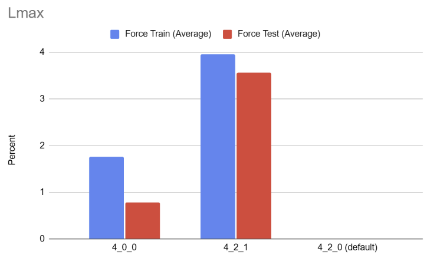

# Training and Results for J14 Potential

Using the **J14 Potential** train and test data, we aim to minimize the loss using **NEP4**.

The parameters are described in this link: https://gpumd.org/nep/input_files/nep_in.html#index-0

---

## Default Parameters and Loss
The default parameters are configured as follows:

The initial loss with the default configuration is shown below:

---

## Phase 1: Minimizing the Loss for Individual Parameters

### Approach to Minimizing Loss:
- Experiment with various combinations of:
  - `nmax`
  - `basis_size`
  - `l_max`
  - `neurons`
  - `batch`

- **Evaluation Criteria:**
  - Take the **MIN** of the last 10 rows of the new loss and compare it to the default loss.
  - Alternatively, take the **AVG** of the last 10 rows of the new loss and compare it to the default.

- **Objective:**
  - Identify the optimal combination for each hyperparameter.
  - Report the **mean** and **average loss gain** for the optimized setup.

---

### Optimized Neurons Setup

We explored configurations with **60 neurons**. The most effective setup was **60 neurons in a single layer**, which yielded the lowest force loss.

### Optimized Basis Setup

We explored configurations with different **basis**. The most effective basis was found to be **4-8**

### Optimized L_max Setup

We explored configurations with different **l_max**. The most effective basis was found to be **4-2-1**

### Optimized Batch Setup

We explored configurations with different **Batch**. The most effective basis was found to be **2000**

